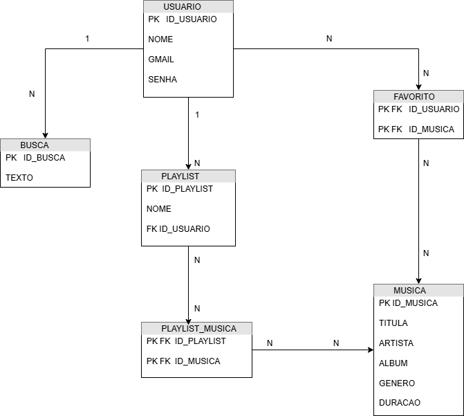

# Unimusic

Unimusic é um aplicativo de música desenvolvido com **Java**, **HTML**, **CSS** e **JavaScript**, que permite aos usuários fazer login, visualizar e reproduzir músicas de forma intuitiva.

## Funcionalidades

* 🔐 Sistema de login e registro de usuário
* 🎧 Listagem e reprodução de músicas
* 🎨 Interface responsiva

## Tecnologias Utilizadas

| Categoria           | Tecnologias                       |
| ------------------- | --------------------------------- |
| **Frontend**        | HTML, CSS, JavaScript             |
| **Backend**         | Java Spring Boot|

## 🧠 Diagrama do Sistema

